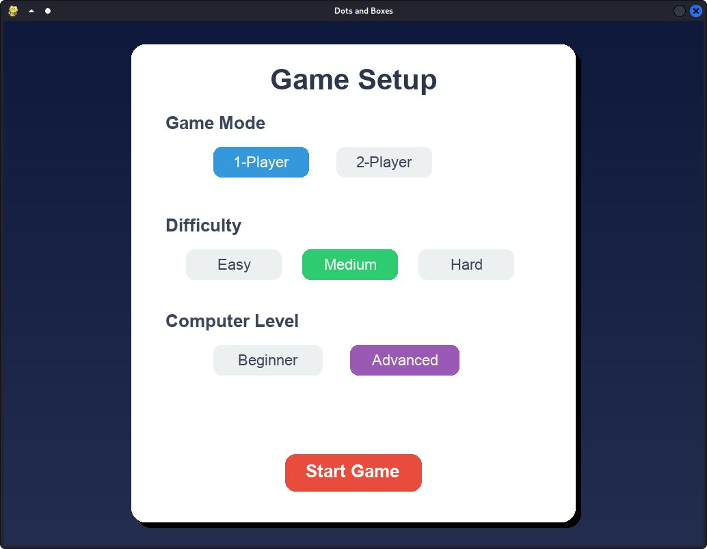
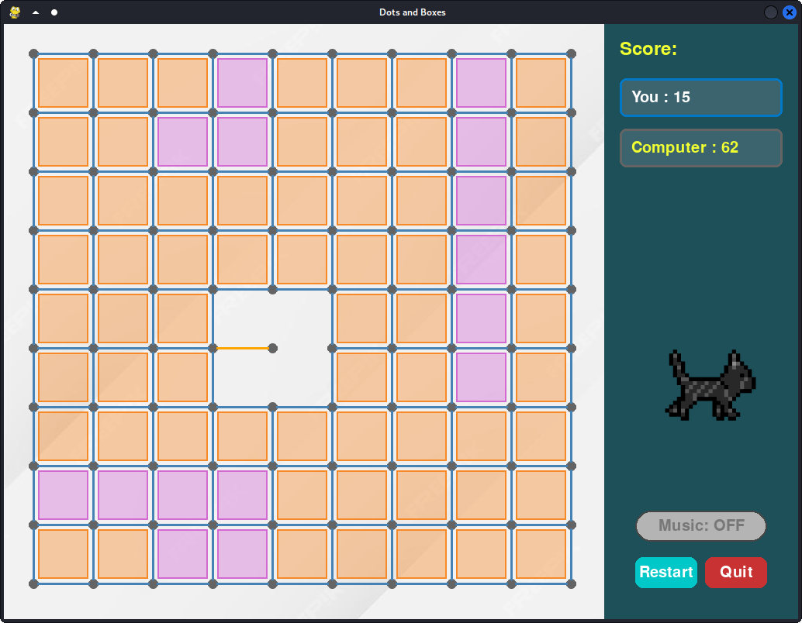
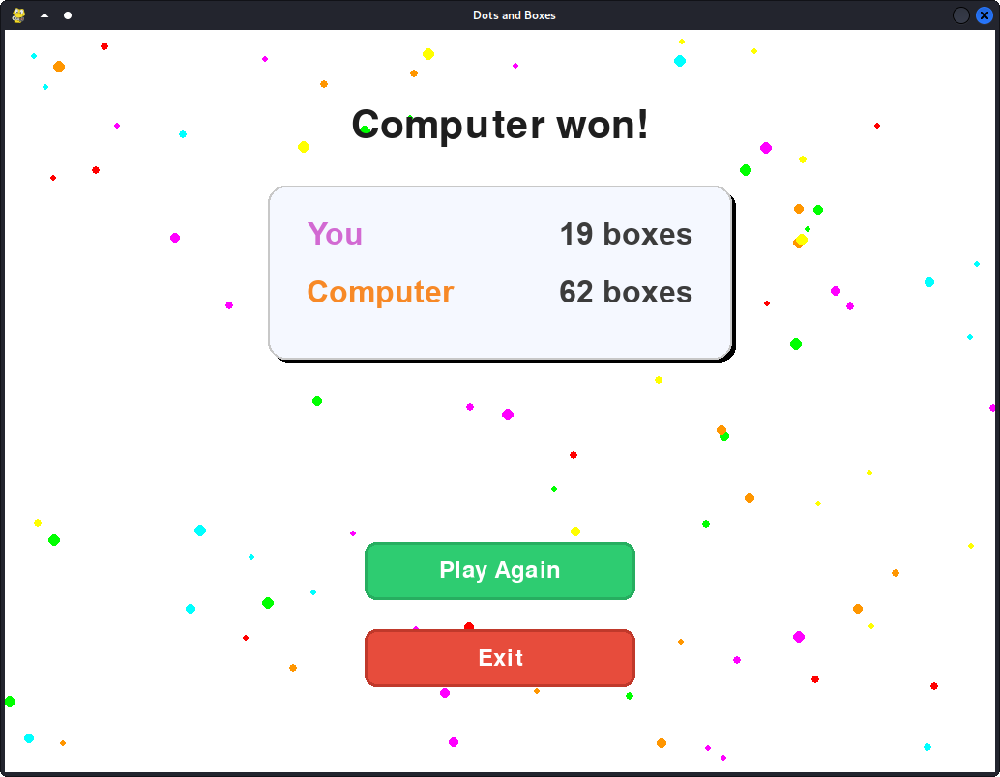

# 🎮 Dots and Boxes — A Classic Puzzle Reimagined in Python

Welcome to **Dots and Boxes**, a modern Python implementation of the timeless pencil-and-paper game. With smooth animations, intuitive GUI, multiple difficulty levels, and sound effects, this game brings childhood nostalgia back to life in a fresh digital form. 
---

## ✨ Features

* 🖌️ **Two Game Modes:** 1-Player vs AI or 2-Player Local Multiplayer
* 💡 **AI Difficulty Levels:** Beginner & Advanced
* 🎲 **Three Grid Sizes:** Easy (6x6), Medium (10x10), Hard (15x15)
* 🎉 **Polished GUI:** Animations, transitions, hover effects, and styled UI
* 🔊 **Immersive Audio:** Background music and responsive sound effects
* 📅 **Fully Offline:** No internet needed after setup
* 🛠️ **Optimized for Linux** with standalone binary support

---

## 🌐 Screenshots

### Game Setup Screen



### Gameplay in Action



### Game Over Screen



---

## 🚀 Run the Game

### Option 1: Standalone Linux Binary

```bash
cd dist
chmod +x DotsAndBoxes
./DotsAndBoxes
```

> ✅ No Python or installation needed.

---

### Option 2: Run with Python

#### Step 1: Clone the Repository

```bash
git clone https://github.com/hafiz_own/DotsAndBoxes.git
cd DotsAndBoxes
```

#### Step 2: Set Up Virtual Environment

```bash
python3 -m venv .venv
source .venv/bin/activate
```

#### Step 3: Install Dependencies

```bash
pip install -r requirements.txt
```

#### Step 4: Run the Game

```bash
python main.py
```

---

## 💻 Build Binary from Source (Linux)

```bash
pyinstaller --onefile --windowed --add-data="assets:assets" main.py
```

* Output binary will be placed inside the `dist/` folder
* Assets are automatically bundled inside the executable

---

## 👍 Running on Windows

1. Install Python and Pygame
2. Clone or copy the project folder
3. Run:

```bash
python gui.py
```

Or build an `.exe` file:

```bash
pyinstaller --onefile --windowed --add-data="assets;assets" main.py
```

---

## 🧠 AI Strategy

* ✅ Completes available boxes
* ❌ Avoids risky 3-sided box traps
* ♻️ Simulates chain reactions to minimize losses
* 🧡 Uses Minimax in advanced mode for smart decision-making

---

## 🛠️ Tech Stack

* Python 3.13
* Pygame
* PyInstaller (for packaging)

---

## 📚 Project Structure

```
DotsAndBoxes/
├── assets/              # Sounds and images
├── game/                # Game logic and modules
├── gui.py               # Graphical user interface
├── main.py              # Game launcher
├── tests/               # Unit tests
├── README.md            # This file
```

---

## 🚚 Future Enhancements

* Save/load games
* Online multiplayer
* Animated particle effects
* Advanced AI learning

---

## 🙋 Author

**Your Name**
GitHub: [@hafiz_own](https://github.com/hafiz_own)

---

> 🚀 *Enjoy playing Dots and Boxes as much as I enjoyed building it!*
